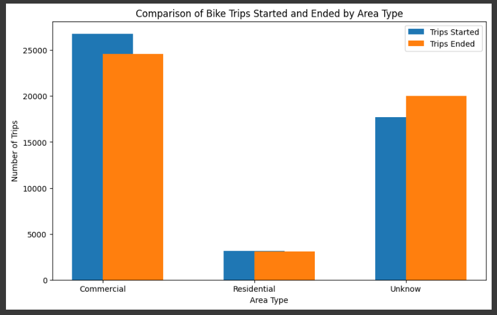
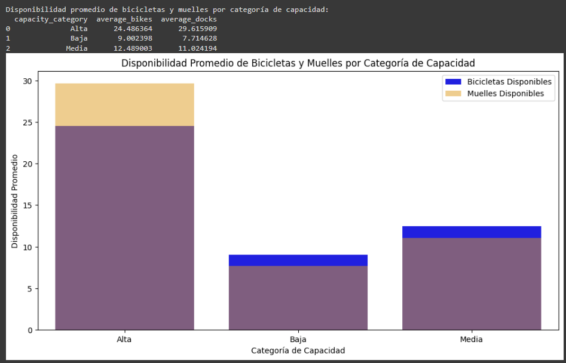

# Proyecto5.NYC-bikes

### Temas

- [Objetivo](#objetivo)
- [Herramientas](#herramientas)
- [Procesamiento](#procesamiento)
  - [Limpieza de datos ](#limpieza_de_datos)
  - [Análisis exploratorio](#análisis_exploratorio)
  - [Hipótesis](#hipótesis)
  - [Score de Riesgo](#score_de_riesgo)
  - [Regresión Logistica](#regresion_logistica)
- [Conclusiones](#Conclusiones)
- [Recomendaciones](#Recomendaciones)
- [Recursos](#Recursos)

### Objetivo

En este proyecto, se llevara a cabo un análisis exploratorio de datos utilizando un dataset sobre el uso de un programa de bicicletas compartidas. Con la finalidad de responder a las preguntas de negocio planteadas.

### **Herramientas**
  1. Google BigQuery
  2. Google Colab
  3. Tableu
  4. Visual Studio

## **Procesamiento**

### 1.1 Limpieza de datos 

Tabla citi_bikes_trips

* Revisión de nulos y duplicados.
* Revision de valores fuera del alcance 
* Visualización e imputación de Outliers

Tabla citi_bikes_stations

* Revision de nulos y duplicados.
* Revision de valores fuera del alcance 
* Visualización e imputación de Outliers

### 1.2 Análisis exploratorio

  * Agrupación de las variables categoricas
  * Visualización de la distribuición de las variables.
  * Visualizacion a lo largo del tiempo.
  * Visualizacion de medidas de tendencia central.
  * Distribuición de las variables.
  * Correlacio entre variables.
  
### 1.3 Hipótesis

1. Hipótesis: Los viajes en bicicleta son más cortos durante las horas pico.
Descripción: Se espera que durante las horas pico (mañana y tarde) los usuarios hagan viajes más cortos debido a la prisa por llegar a su destino, como el trabajo o la escuela.

>
>

    Resolución: **Negativa** La prueba t y la gráfica de distribución sugieren que no hay una diferencia estadísticamente significativa en la duración de los viajes entre las horas pico y no pico. Esto significa que, basándote en los datos actuales, no puedes concluir que los viajes son más cortos durante las horas pico.

2. Hipótesis: Las estaciones en áreas comerciales tienen una mayor rotación de bicicletas.
Descripción: Las estaciones ubicadas en áreas comerciales o de alto tránsito deberían tener un mayor número de viajes iniciados y terminados en comparación con estaciones en áreas residenciales.

>
>

    Resolución: **Positiva** La gráfica sugiere que las estaciones comerciales tienen una rotación significativamente mayor que las estaciones residenciales, lo que valida la hipótesis. Sin embargo, la cantidad de estaciones clasificadas como "Unknow" también es alta, lo que podría requerir una revisión adicional para mejorar la precisión del análisis.

3. Hipótesis: Los usuarios suscritos realizan viajes más largos que los usuarios ocasionales.

>
>

    Resolución: **Validada**  Los resultados estadísticos apoyan la hipótesis de que los usuarios ocasionales realizan viajes más largos que los usuarios suscritos.
    La gráfica de densidad revela que los viajes de los usuarios suscritos (Subscriber) se agrupan en torno a una media de 675.81 segundos, indicando que la mayoría de sus viajes son relativamente cortos. En contraste, los viajes de los usuarios ocasionales (Customer) presentan una distribución más amplia, con una media de 1118.13 segundos, lo que sugiere que estos viajes tienden a ser más largos.

**4. Hipótesis:** La disponibilidad de bicicletas es menor durante las horas pico.
Descripción: Durante las horas pico, la demanda de bicicletas es alta, lo que podría resultar en una menor disponibilidad de bicicletas en las estaciones.

>
>

    Resolucion: **Validada** La gráfica respalda la hipótesis de que la disponibilidad de bicicletas es significativamente menor durante las horas pico en comparación con las horas no pico. La diferencia entre las dos categorías es muy marcada, con una disponibilidad promedio que cae a cero durante las horas de mayor demanda.

**5. Hipótesis:** Las estaciones con mayor capacidad tienen menos problemas de disponibilidad.

>
> 

Estaciones con Capacidad Alta:
* Bicicletas Disponibles: Promedio de 24.49.
* Muelles Disponibles: Promedio de 29.62.
* Conclusión: Manejan mejor la demanda, manteniendo buena disponibilidad.

Estaciones con Capacidad Media:
* Bicicletas Disponibles: Promedio de 12.49.
* Muelles Disponibles: Promedio de 11.02.
* Conclusión: Menor disponibilidad comparada con estaciones de alta capacidad, posiblemente más afectadas por la demanda.

Estaciones con Capacidad Baja:
* Bicicletas Disponibles: Promedio de 9.00.
* Muelles Disponibles: Promedio de 7.71.
* Conclusión: Enfrentan mayores desafíos en mantener la disponibilidad.

>
>

    Resolución: **Parcialmente Validada** Aunque las estaciones con mayor capacidad tienden a tener más bicicletas disponibles, la amplia dispersión de los datos indica que la capacidad no es el único factor determinante de la disponibilidad. Es posible que factores como la demanda local, la ubicación de la estación, o la eficiencia del reabastecimiento de bicicletas también jueguen un papel importante.

### **Conclusiones**
Las estaciones con mayor capacidad tienden a tener mejor disponibilidad de bicicletas, pero la alta demanda durante las horas pico sigue representando un desafío significativo. Los resultados sugieren que, además de aumentar la capacidad, es crucial implementar estrategias de reabastecimiento dinámico y segmentación de usuarios para mejorar la eficiencia del sistema y satisfacer mejor la demanda de los usuarios.

### **Recomendaciones**

* Reabastecimiento Dinámico: Implementar sistemas que respondan en tiempo real a la demanda, usando algoritmos de predicción para anticipar y reabastecer estaciones antes de que se agoten.
* Segmentación y Pricing: Diferenciar estrategias de precios y servicios para usuarios ocasionales y suscritos, ofreciendo descuentos para viajes largos a los ocasionales y tarifas planas para los suscritos.
* Aumento de Capacidad: Incrementar la capacidad en estaciones de alta demanda, como centros comerciales y áreas de oficinas, complementado con una gestión activa de redistribución de bicicletas.
* Análisis y Monitoreo: Realizar análisis continuos para identificar patrones de demanda y ajustar la distribución y capacidad de las estaciones, monitoreando la efectividad de las estrategias.
* Factores Adicionales: Investigar otros factores que afectan la disponibilidad, como proximidad a transporte público, eventos locales o condiciones meteorológicas.
* Mejora de la Experiencia del Usuario: Implementar alertas en la aplicación para informar sobre la disponibilidad de bicicletas en tiempo real, especialmente durante las horas pico.

## **Recursos**

### Presentación del Proyecto 
